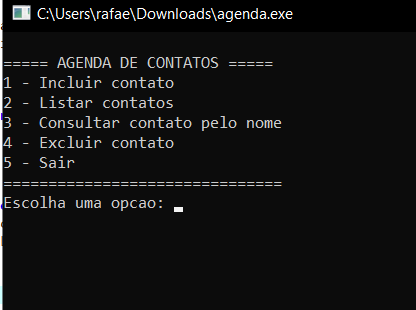
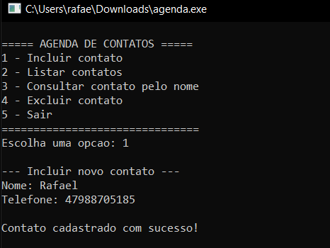
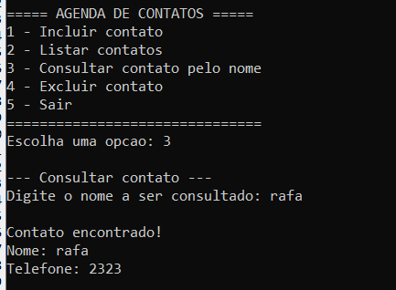
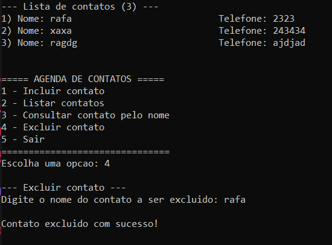
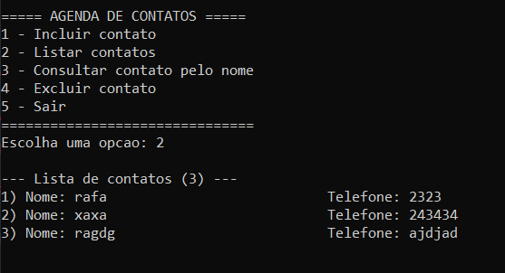

# Agenda de Contatos em C ANSI | Contact Management System in ANSI C

| Português 🇧🇷                                                                                               | English 🇺🇸                                                                              |
| ------------------------------------------------------------------------------------------------------------ | ----------------------------------------------------------------------------------------- |
| Sistema de gerenciamento de contatos desenvolvido em C ANSI para a disciplina de Fundamentos de Programação. | Contact management system developed in ANSI C for the Fundamentals of Programming course. |

---

# Visão Geral | Overview

| Português 🇧🇷                                                                                                                                                                      | English 🇺🇸                                                                                                                                                                           |
| ----------------------------------------------------------------------------------------------------------------------------------------------------------------------------------- | -------------------------------------------------------------------------------------------------------------------------------------------------------------------------------------- |
| O projeto foi desenvolvido utilizando programação estruturada, com foco em modularização, vetores, funções e manipulação manual de strings sem utilização da biblioteca `string.h`. | The project was developed using structured programming principles, focusing on modularization, arrays, functions, and manual string manipulation without using the `string.h` library. |
| O sistema executa em modo console e permite gerenciamento básico de contatos.                                                                                                       | The system runs in console mode and provides basic contact management operations.                                                                                                      |

---

# Funcionalidades | Features

| Português 🇧🇷       | English 🇺🇸      |
| -------------------- | ----------------- |
| Inclusão de contatos | Contact insertion |
| Listagem de contatos | Contact listing   |
| Consulta por nome    | Name-based search |
| Exclusão de contatos | Contact deletion  |
| Menu interativo      | Interactive menu  |

---

# Tecnologias Utilizadas | Technologies Used

| Português 🇧🇷       | English 🇺🇸       |
| -------------------- | ------------------ |
| Linguagem C ANSI     | ANSI C Language    |
| GCC Compiler         | GCC Compiler       |
| Execução em terminal | Terminal execution |
| Git e GitHub         | Git and GitHub     |

---

# Estrutura do Projeto | Project Structure

```txt id="3h0xg9"
agenda-contatos-c/
│
├── src/
│   └── agenda_contatos.c
│
├── docs/
│   ├── relatorio.docx
│   └── screenshots/
│
├── video/
│   └── demonstracao.mp4
│
├── README.md
├── LICENSE
└── .gitignore
```

---

# Arquitetura do Sistema | System Architecture

| Português 🇧🇷                                                                                                  | English 🇺🇸                                                                                                |
| --------------------------------------------------------------------------------------------------------------- | ----------------------------------------------------------------------------------------------------------- |
| O sistema foi dividido em funções independentes para melhorar organização, reutilização e manutenção do código. | The system was divided into independent functions to improve organization, code reuse, and maintainability. |
| O fluxo principal é controlado através de um loop `do-while` combinado com estrutura `switch-case`.             | The main execution flow is controlled using a `do-while` loop combined with a `switch-case` structure.      |

---

# Estruturas de Dados | Data Structures

## Vetor de nomes | Names Array

```c id="c0s4gh"
char nomes[MAX_CONTATOS][TAM_NOME];
```

## Vetor de telefones | Phone Numbers Array

```c id="h4g1ys"
char telefones[MAX_CONTATOS][TAM_TELEFONE];
```

| Português 🇧🇷                                            | English 🇺🇸                                      |
| --------------------------------------------------------- | ------------------------------------------------- |
| Cada posição representa um contato armazenado na memória. | Each index represents a contact stored in memory. |
| Os vetores funcionam de forma sincronizada.               | Arrays operate synchronously.                     |

---

#Explicação das Funções | Function Breakdown

---

## `main()`

| Português 🇧🇷                                        | English 🇺🇸                                         |
| ----------------------------------------------------- | ---------------------------------------------------- |
| Responsável pelo controle principal do programa.      | Responsible for the application's main control flow. |
| Gerencia menu, opções e execução das funcionalidades. | Manages menu navigation and feature execution.       |

---

## `exibirMenu()`

| Português 🇧🇷                      | English 🇺🇸                            |
| ----------------------------------- | --------------------------------------- |
| Exibe o menu principal no terminal. | Displays the main menu in the terminal. |

---

## `limparBufferEntrada()`

| Português 🇧🇷                                             | English 🇺🇸                                                           |
| ---------------------------------------------------------- | ---------------------------------------------------------------------- |
| Remove caracteres residuais do buffer após uso do `scanf`. | Removes residual characters from the input buffer after `scanf` usage. |

---

## `removerQuebraLinha()`

| Português 🇧🇷                               | English 🇺🇸                                        |
| -------------------------------------------- | --------------------------------------------------- |
| Remove o caractere `\n` gerado pelo `fgets`. | Removes the newline character generated by `fgets`. |

---

## `copiarString()`

| Português 🇧🇷                                  | English 🇺🇸                                          |
| ----------------------------------------------- | ----------------------------------------------------- |
| Realiza cópia manual de strings sem `string.h`. | Performs manual string copy without using `string.h`. |

---

## `compararNomes()`

| Português 🇧🇷                                          | English 🇺🇸                                        |
| ------------------------------------------------------- | --------------------------------------------------- |
| Compara dois nomes manualmente caractere por caractere. | Compares two names manually character by character. |

---

## `incluirContato()`

| Português 🇧🇷                      | English 🇺🇸                       |
| ----------------------------------- | ---------------------------------- |
| Realiza cadastro de novos contatos. | Handles insertion of new contacts. |
| Verifica limite máximo da agenda.   | Checks maximum storage capacity.   |

---

## `listarContatos()`

| Português 🇧🇷                                              | English 🇺🇸                                         |
| ----------------------------------------------------------- | ---------------------------------------------------- |
| Percorre os vetores exibindo todos os contatos cadastrados. | Traverses arrays displaying all registered contacts. |

---

## `consultarContato()`

| Português 🇧🇷                                           | English 🇺🇸                                      |
| -------------------------------------------------------- | ------------------------------------------------- |
| Executa busca sequencial utilizando comparação de nomes. | Performs sequential search using name comparison. |

---

## `excluirContato()`

| Português 🇧🇷                                                       | English 🇺🇸                                         |
| -------------------------------------------------------------------- | ---------------------------------------------------- |
| Remove contatos da memória.                                          | Removes contacts from memory.                        |
| Os elementos subsequentes são deslocados para evitar espaços vazios. | Subsequent elements are shifted to avoid empty gaps. |

---

# Fluxo de Execução | Execution Flow

```txt id="6z0hvw"
Inicialização do programa
        ↓
Alocação dos vetores
        ↓
Exibição do menu
        ↓
Leitura da opção
        ↓
Execução da funcionalidade
        ↓
Retorno ao menu principal
        ↓
Encerramento do sistema
```

---

# Complexidade | Complexity

| Operação | Complexidade |
| -------- | ------------ |
| Inclusão | O(1)         |
| Consulta | O(n)         |
| Exclusão | O(n)         |
| Listagem | O(n)         |

---

# Compilação | Compilation

## Linux / macOS

```bash id="4t5mzn"
gcc src/agenda_contatos.c -o agenda
```

## Windows

```bash id="q9s0jx"
gcc src/agenda_contatos.c -o agenda.exe
```

---

#  Execução | Execution

## Linux / macOS

```bash id="4nz5gs"
./agenda
```

## Windows

```bash id="q2vx6r"
agenda.exe
```

---

# Screenshots

## Menu Principal | Main Menu



---

## Cadastro | Contact Registration



---

## Consulta | Search



---

## Exclusão | Deletion



---

## Listagem | Listing



---

# Demonstração | Demonstration

[Assistir Demonstração | Watch Demonstration](video/demonstracao.mp4)

---

# Conceitos Aplicados | Applied Concepts

| Português 🇧🇷                | English 🇺🇸               |
| ----------------------------- | -------------------------- |
| Programação estruturada       | Structured programming     |
| Vetores bidimensionais        | Bidimensional arrays       |
| Funções                       | Functions                  |
| Estruturas condicionais       | Conditional structures     |
| Estruturas de repetição       | Iteration structures       |
| Manipulação manual de strings | Manual string manipulation |
| Busca sequencial              | Sequential search          |

---

# Melhorias Futuras | Future Improvements

| Português 🇧🇷           | English 🇺🇸            |
| ------------------------ | ----------------------- |
| Persistência em arquivos | File persistence        |
| Uso de `struct`          | `struct` implementation |
| Ordenação alfabética     | Alphabetical sorting    |
| Busca parcial            | Partial search          |
| Edição de contatos       | Contact editing         |
| Interface gráfica        | Graphical interface     |

---

# Autor | Author

Rafael Rodrigues

---

# Disciplina | Course

Fundamentos de Programação | Fundamentals of Programming

---

#  Licença | License

MIT License
